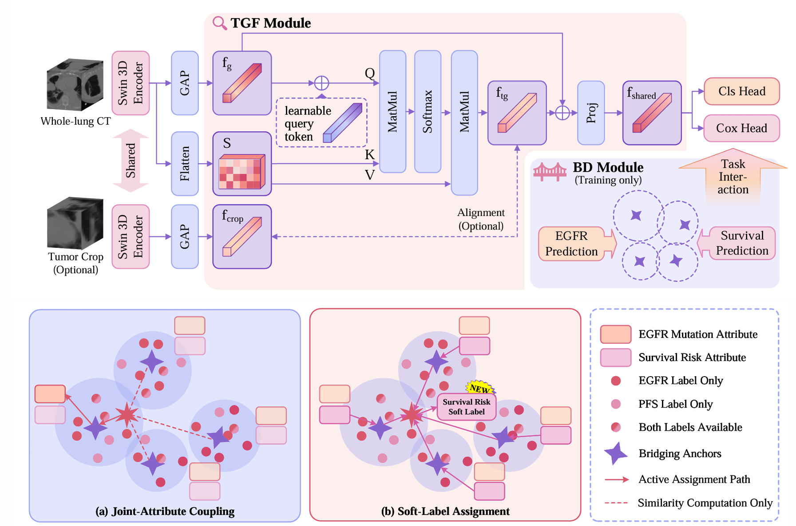

# TGBD-Net
This repository contains the official implementation of the paper: “TGBD-Net: Tumor-Guided Joint Learning for EGFR Mutation Prediction and Survival Estimation in Lung CT via Bridging Distillation” (Submitted to MICCAI 2026)

## 🚀Introduction

Epidermal growth factor receptor (EGFR) mutation prediction and progression-free survival (PFS) estimation are critical tasks in lung cancer management and are often derived from the same CT imaging data in clinical practice. However, real-world datasets commonly exhibit heterogeneous supervision, where task labels and auxiliary spatial annotations are incomplete and unevenly distributed across patients and tasks, limiting the effectiveness of conventional multi-task learning frameworks. In this work, we propose Tumor-Guided Net with Bridging Distillation (TGBD-Net), a unified framework for joint modeling these two tasks under heterogeneous supervision. The proposed tumor-guided feature extraction (TGF) module leverages limited tumor bounding box as spatial priors by guiding feature extraction through alignment, without requiring explicit localization prediction. In addition, a bridging distillation (BD) module is introduced to structure cross-task interactions during training via shared anchors, facilitating stable shared representation learning rather than direct label imputation. Experiments on a large-scale clinical lung CT cohort of 7,348 patients demonstrate that TGBD-Net achieves consistent and balanced performance, with an AUC of 0.823 for EGFR mutation prediction and a C-index of 0.743 for PFS estimation, highlighting its effectiveness in realistic heterogeneous supervision settings.

## 📝 Citation
If you find this work useful, please cite our paper: comming soon...
