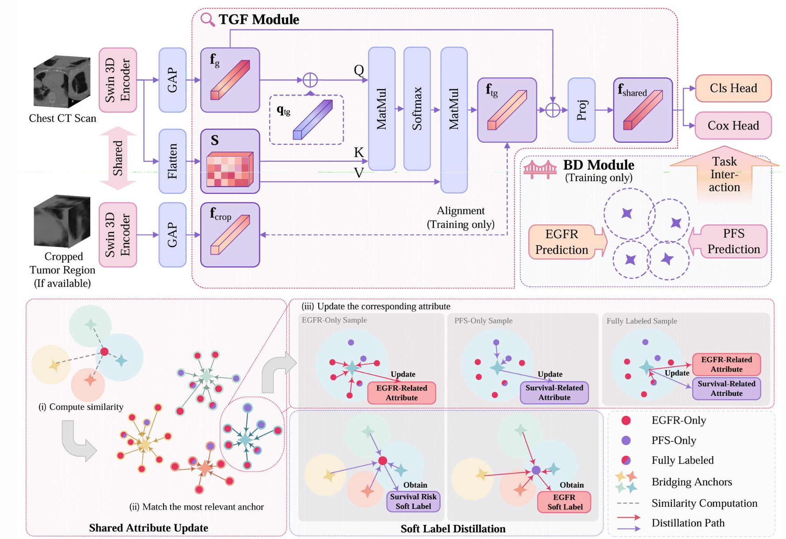

# TGBD-Net
This repository contains the official implementation of the paper: “TGBD-Net: Tumor-Guided Bridging Distillation for Joint EGFR Mutation and Survival Prediction in Lung Cancer from CT Imaging” (Submitted to MICCAI 2026)

## 🚀Introduction

Epidermal growth factor receptor (EGFR) mutation prediction and progression-free survival (PFS) prediction are critical tasks for targeted therapy planning in lung cancer and can be jointly modeled from the same chest CT scan. In real-world clinical datasets, supervision is often inconsistent across patients: not all patients have labels for both tasks and tumor region annotations, leading to heterogeneous supervision across different patient subsets. However, most existing multi-task learning methods leverage a single shared representation across tasks, with limited consideration of representation consistency during training on these differently supervised patient subsets. In this study, we propose Tumor-Guided Bridging Distillation Network (TGBD-Net), a unified framework for stabilizing representation learning under heterogeneous supervision, enabling joint EGFR mutation and PFS prediction. The proposed Tumor-Guided Feature Extraction (TGF) module regularizes feature learning using available tumor region annotations, while maintaining consistent behavior when such annotations are unavailable. In addition, a Bridging Distillation (BD) module enables cross-task knowledge transfer, allowing patients with single-task labels to contribute to joint representation learning. Experiments on a cohort of 7,348 patients with lung cancer demonstrate that TGBD-Net achieves an AUC of 0.823 for EGFR mutation prediction and a C-index of 0.743 for PFS prediction, highlighting its effectiveness in real clinical settings.

## 📝 Citation
If you find this work useful, please cite our paper: comming soon...
